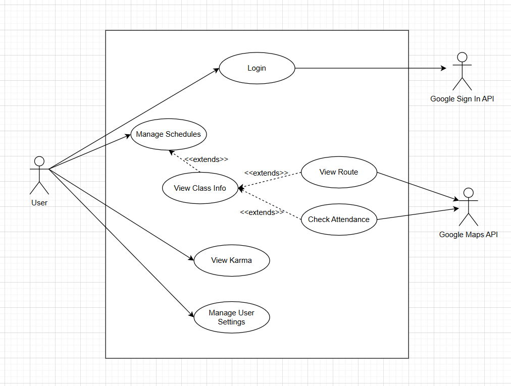
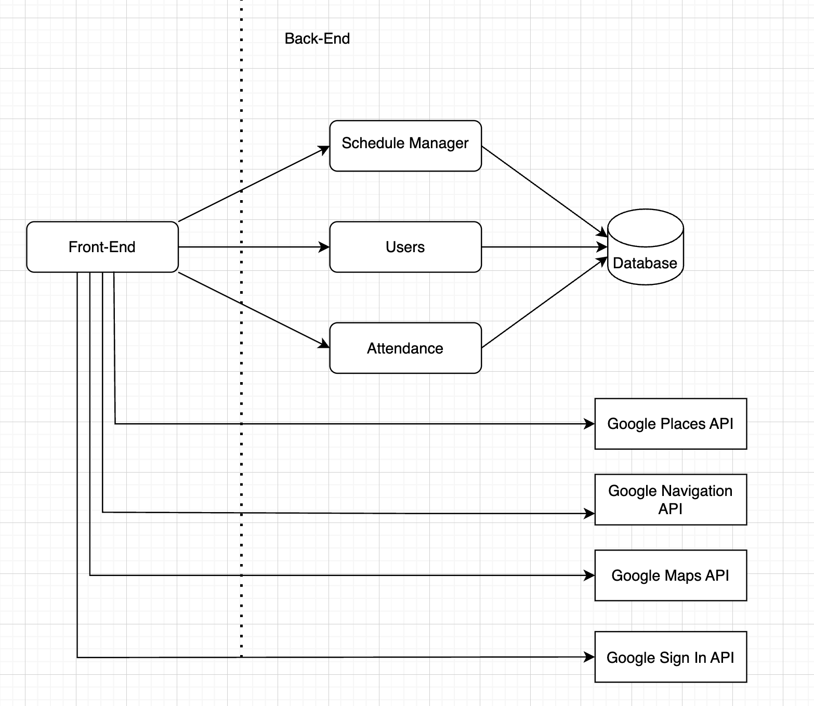
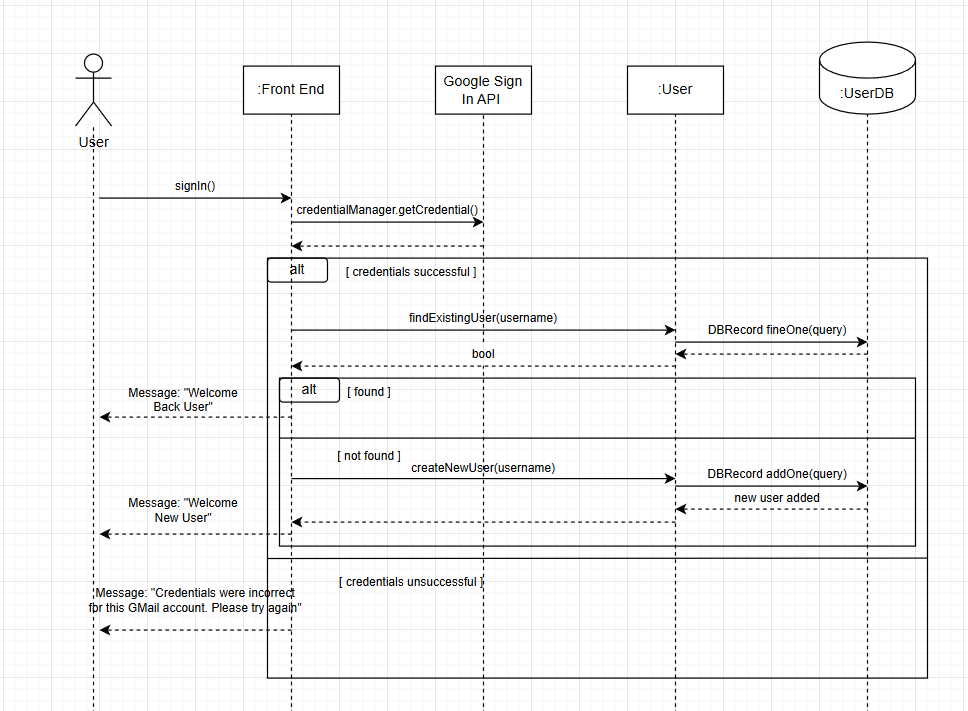
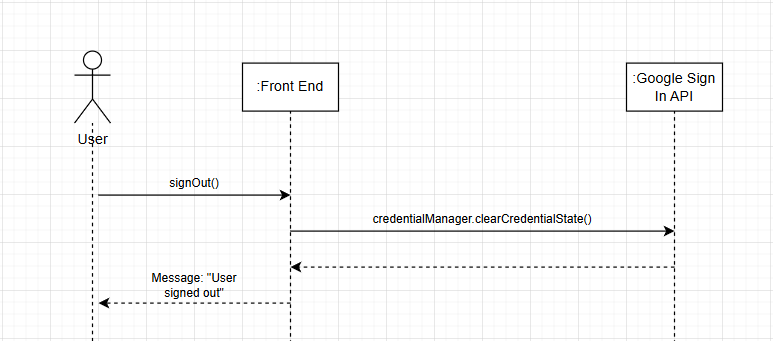
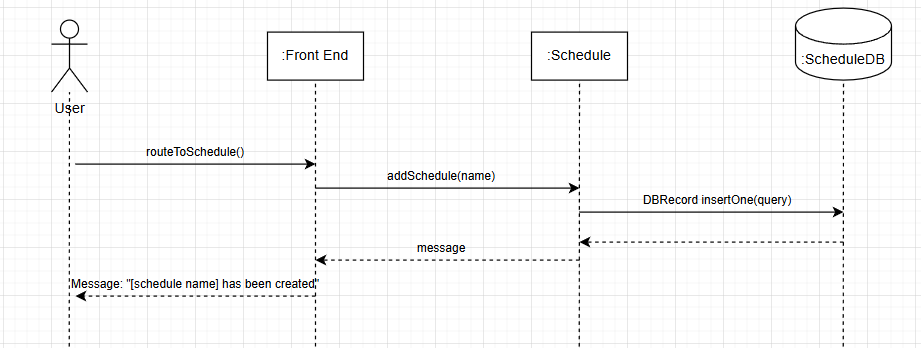
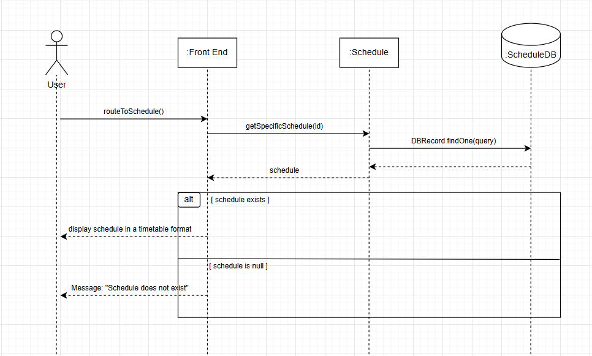

# M3 - Requirements and Design

## 1. Change History
1. Updated section 3.1, on February 28. 
    - Updated the Use-Case Diagram to use verbs in accordance with M3 feedback.
    - Changed includes to extends to accurately depict relationships.
2. Updated section 3.3-2, on February 28.
    - Removed create schedule use case since this is now done automatically upon account creation.
    - Added language to describe Fall, Winter, Summer schedule format.
    - Changed **import** to **upload** and **delete** to **clear** to accurately depict actions.
    - Changed **csv** to **xlsx** since Workday no longer allows csv download.
    - Removed failure scenario for clear schedule in accordance with M3 feedback.
3. Updated section 3.3-3, on February 28.
    - Removed attendance checking as that is a separate feature.
4. Updated section 3.5-3, on February 28.
    - Added further justification to NFRs 1 and 2 in accordance with M3 feedback.
    - Removed NFR 3 as it was extraneous and not justifiable.
5. Updated section 4, on February 28.
    - Changed **username** to **sub** (subject) in many places as this is the unique identifier provided by Google Authentication that we are using to identify user data in our data bases.
6. Updated section 4.1, on March 2.
    - Removed attendance component as we implemented this component in our frontend
    - Added checkAttendance() interface to frontend.
    - Added Notification component as per M3 feedback and per our implementation plans.
    - Updated User and Schedule component to align with the ScheduleController.ts and UserController.ts functions
7. Updated section 4.5, on March 2.
    - Updated dependency diagram to match changes to section 4.1.
8. Updated section 4.8, on March 2.
    - Updated description of complexity component and pseudo code to better align with our actual implementation.
9. Updated section 3.3-2.1.3a, on March 15.
    - Changed failure case from uploading invalid file to uploading file to wrong term. This change was made because the library we use doesn't allow you to upload a file of the wrong type so this would not be testable.
10. Updated section 3.3-5, on March 15.
    - Changed use case to match what was actually implemented which was much more complex.
11. Updated section 3.3-3, on March 17.
    - Changed the failure scenario to match what was actually implemented, which will ask the user to grant location permissions in Settings if they deny the request.
12. Updated section 3.5, on March 17.
    - Updated the second non-functional requirements to match the main use case (check attendance). This will make it more measurable and comprehensive, as it will cover more system components and thoroughly test the core functionality.
13. Update section 3.1, on March 19.
    - Added 2 new use cases: View Class Info and View Karma
    - Updated the use case diagram to match the actual implementation, which is more comprehensive and includes more functionalities.
14. Updated section 3.3-6&7, on March 19.
    - Added formal use case specifications for View Class Info and View Karma
    - Updated the functional requirements to match the changes in Change 13.
15. Updated sections 4.3 & 4.4, on March 29.
    - Added Google Places API and Navigation API and removed Firebase Cloud Messaging API
16. Updated section 4.1, on April 2.
    - Removed notifications and added Attendance controller


## 2. Project Description
Get2Class is a gamified calendar to help students get to class on time. The main target audience for this app will be UBC students and professors. The main problem we are trying to solve is simplifying the Workday Student calendar as it is unintuitive and difficult to use. We will make it easy to set up your calendar using data from Workday. It can be difficult, especially for first-year’s, to find your classes using the building acronym on Workday. We will provide maps and walking routes. Additionally, we want to help motivate students to be punctual and attend their classes. Our application aims to solve this by implementing a notification and points system that helps and motivates users to go to classes and provides best routes to reach their next class.

## 3. Requirements Specification
### **3.1. Use-Case Diagram**


### **3.2. Actors Description**
1. **User**: The User is a student/professor which utilizes the application to help get them to their next class.
2. **Google Maps API**: The Google Maps API is the actor which will display locations and routes for the user. Additionally, this API will be utilized by the "View Route" and "Check Attendance" use case.
3. **Google Sign In API**: The Google Sign In API is the actor which authenticates users into the application. Additionally, this API will be utilized by the "User Login and Authentication" use case.

### **3.3. Functional Requirements**
<a name="fr1"></a>

1. **User Login and Authentication** 
    - **Overview**:
        1. Sign In to Account: System must allow user to utilize external authentication to login to the app
        2. Log Out of Account: System must allow user to log out of the app (which utilizes the external authentication)     
    - **Detailed Flow for Each Independent Scenario**: 
        1. **Sign In to Account**<a name="fr1_1"></a>:
            - **Description**: The user will utilize an external authentication API such as Google Sign In API to log themselves into the app with their credentials as a user.
            - **Primary actor(s)**: User, Google Sign In API
            - **Main success scenario**:
                1. User will click on the Google Sign In button
                2. A popup/rerouting of the page will occur providing the user a screen to enter their Google credentials into a box
                3. Once the user hits the Login button they will then be routed to the home page of the application
            - **Failure scenario(s)**:
                - 2a. The user enters invalid credentials
                    - 2a1. The app routes the user back to log in screen
                    - 2a2. An error message is displayed telling the user of the error (e.g. error getting credentials)
                    - 2a3. The app prompts the user to try to log in again
        2. **Log Out of Account**<a name="fr1_2"></a>:
            - **Description**: The user will utilize the external authentication API such as Google Sign In API to log themselves out of the app
            - **Primary actor(s)**: User, Google Sign In API
            - **Main success scenario**:
                1. User will click on the Log Out button
                2. A rerouting of the page will occur which brings the user back to the login page of the app
            - **Failure scenario(s)**:
                - N/A
    
2. **Manage Schedules**
    - **Overview**:
        1. Upload Schedule: The system must allow the user to upload their schedule from Workday as an xlsx file
        2. View Schedule: The system must allow the user to view their schedule in a clear and understandable format
        3. Clear Schedule: The system must allow the user to clear an existing schedule
    - **Detailed Flow for Each Independent Scenario**:
        1. **Upload Schedule**<a name="fr2_2"></a>:
            - **Description**: The user can upload their own schedule from Workday as a xlsx file to one of their three schedules: Fall, Winter, and Summer
            - **Primary actor(s)**: User
            - **Main success scenario**:
                1. The user chooses which schedule they want to set
                2. The user will then click on the Upload Schedule button
                3. A popup or page reroute will occur requesting the user to upload a (valid) .xlsx file (from Workday)
                4. Once the user successfully uploads an .xlsx file of their schedule, the blank schedule will become populated with the users uploaded schedule 
            - **Failure scenario(s)**:
                - 3a. The user uploads their schedule to the wrong term
                    - 3a1. An error message is displayed telling the user that that the schedule is not for the currently selected term
        2. **View Schedule**<a name="fr2_3"></a>:
            - **Description**: The user can view their schedules and a particular schedule
            - **Primary actor(s)**: User
            - **Main success scenario**:
                1. The user selects (clicks on) one schedule
                2. The app opens up the schedule for the user to view
            - **Failure scenario(s)**:
                - N/A
        3. **Clear Schedule**<a name="fr2_4"></a>:
            - **Description**: The user can clear their existing schedules
            - **Primary actor(s)**: User
            - **Main success scenario**:
                1. The user selects one schedule (Fall, Winter, or Summer)
                2. The app pops up a warning message for deleting the selected schedule
                3. If the user hits Confirm, the app clears the schedule and the warning is dismissed
            - **Failure scenario(s)**:
                - N/A

3. **View Map/Route**
    - **Overview**:
        1. View Route: The system must display to the user a route to their next class
    - **Detailed Flow for Each Independent Scenario**:
        1. **View Route**<a name="fr3_1"></a>:
            - **Description**: The user can view the optimal route to the next class based on their schedule and the current location
            - **Primary actor(s)**: User, Google Maps API
            - **Main success scenario**:
                1. The user clicks on View Route
                2. The app prompts the user to grant location permissions if not already granted
                3. The user sees their current location and destination location together with the optimal route on the screen
            - **Failure scenario(s)**:
                - 2a. The user does not grant location permissions
                    - 2a1. If the user denies, the app shows a toast to tell the user to enable location permissions in the settings first
                    - 2a2. The app routes the user back to the previous screen

4. **Manage User Settings**
    - **Overview**:
        1. View Profile and Settings: The system must allow the user to view their profile and settings
        2. Update Notifications: The system must allow the user to manage their notification settings
    - **Detailed Flow for Each Independent Scenario**:
        1. **View Profile and Settings**<a name="fr4_1"></a>:
            - **Description**: The user can view their profile and accumulated points (karma)
            - **Primary actor(s)**: User
            - **Main success scenario**:
                1. The user clicks on their profile
                2. The app routes them to their profile page
            - **Failure scenario(s)**:
                - N/A
        2. **Update Settings**<a name="fr4_2"></a>:
            - **Description**: The user can change their notification preferences
            - **Primary Actor(s)**: User
            - **Main success scenario**:
                1. The user clicks on the notification settings
                2. The apps routes them to the notification settings screen
                3. The app prompts the user to grant notifications permissions if not already granted
                3. The user can toggle the Notifications option on or off
            - **Failure scenario(s)**:
                - 3a. The user does not grant notifications permissions
                    - 3a1. The app prompts the user for permissions again with rationale
                    - 3a2. If the user denies twice, the app shows a dialog to tell the user to enable notifications permissions in the settings first
                    - 3a3. The app routes the user back to the previous screen

5. **Check Attendance**
    - **Overview**:
        1. Check Attendance: The system must allow the user to check themselves into the class to obtain their points (karma)
    - **Detailed Flow for Each Independent Scenario**:
        1. **Check Attendance**<a name="fr5_1"></a>:
            - **Description**: The user can check themselves in when they arrive at the classroom and the system will provide to the user points (karma)
            - **Primary actor(s)**: User, Google Maps API
            - **Main success scenario**:
                1. User clicks on the "Check in to class" button
                2. The user receives a toast telling them they got 60 Karma
            - **Failure scenario(s)**:
                - 2a. The class is not from this year
                    - 2a1. The user receives a toast explaining the error
                - 2b. The class is not from this term
                    - 2b1. The user receives a toast explaining the error
                - 2c. The class is not on this day of the week
                    - 2c1. The user receives a toast explaining the error
                - 2d. It's too early in the day to check in to the class
                    - 2d1. The user receives a toast explaining the error
                - 2e. It's too late in the day to check in to the class
                    - 2e1. The user receives a toast explaining the error
                - 2f. The user already checked into class today
                    - 2f1. The user receives a toast explaining the error
                - 2g. The user went to class, but they were not on time
                    - 2g1. The user receives a toast telling them how late they were and another telling them how much Karma they gained
                - 2c. The user is in the wrong location
                    - 2h1. The user receives a toast explaining the error

6. **View Class Info**
    - **Overview**:
        1. The system must allow the user to view the information of any class on their schedules.
    - **Detailed Flow for Each Independent Scenario**:
        1. **View Class Info**<a name="fr5_1"></a>:
            - **Description**: The user can see the class information, including the course name, class type, credits, time and location, by simply clicking a class section on their schedules.
            - **Primary actor(s)**: User
            - **Main success scenario**:
                1. On one of the schedules, the user clicks a class section
                2. The user sees the information of that class, including the course name, class type, credits, time and location, along with the "View route to class" and "Check in to class" buttons 
            - **Failure scenario(s)**:
                - N/A

7. **View Karma**
    - **Overview**:
        1. The system must allow the user to view their up-to-date Karma points.
    - **Detailed Flow for Each Independent Scenario**:
        1. **View Karma**<a name="fr5_1"></a>:
            - **Description**: The user can check their current Karma points, by simply clicking the "Karma" button on the home page after they log in.
            - **Primary actor(s)**: User
            - **Main success scenario**:
                1. On the home page, the user clicks the "Karma" button
                2. The user sees their updated Karma points
            - **Failure scenario(s)**:
                - N/A

### **3.4. Screen Mockups**
N/A

### **3.5. Non-Functional Requirements**

1. **Schedule Usability** <a name="nfr1"></a>
    - **Description**: All schedules operations (upload, view, clear) should be processed and reflected on the screen within 4 seconds of the user action.
    - **Justification**: Quick schedule display avoids user dissatisfaction and saves time for busy professors and students to check the time and location for their upcoming classes. According to https://think.storage.googleapis.com/docs/mobile-page-speed-new-industry-benchmarks.pdf, as page load time goes from 1s to 3s, the probability of bounce increases 32%.
2. **Check in Usability** <a name="nfr2"></a>
    - **Description**: The user will see if they have checked in successfully or not, along with the amount of Karma points awarded, within 4 seconds of clicking the "Check in to class" button.
    - **Justification**: Quick check in feedback reassures the user that their action is successful and to instantly reward them with Karma points. This fast confirmation can minimize anxiety, prevent repetitive attempts and reinforce trust in the system. According to https://think.storage.googleapis.com/docs/mobile-page-speed-new-industry-benchmarks.pdf, as page load time goes from 1s to 3s, the probability of bounce increases 32%.


## 4. Designs Specification
### **4.1. Main Components**
1. **Schedule**
    - **Purpose**: Manages schedule data and interacts with the schedule database/collection
    - **Interfaces**:
        1. Schedule getSchedule(String scheduleId)
            - **Purpose**: Retrieves a specific schedule of the user given the schedule id and returns back a schedule to the user
        2. void clearSchedule(String scheduleId)
            - **Purpose**: Clears the data of a specific schedule
        3. void importSchedule(File xlsxFile, String scheduleId)
            - **Purpose**: Import a Workday schedule as a xlsx file onto a blank schedule that the user selects
        4. void updateAttendance(String userId, String scheduleId, String className, String classFormat)
            - **Purpose**: Updates the attendance of a class that user has attended
        5. boolean getAttendance(String userId, String scheduleId, String className, String classFormat)
            - **Purpose**: Returns back to the user whether the user has attended the class they are trying to check into already or not
2. **User**
    - **Purpose**: Manages the user settings and provides communication to user database/collection which stores the username, sub, points (karma), and settings of a particular user
    - **Interfaces**:
        1. void createNewUser()
            - **Purpose**: Creates a new user entry into the database if a newly logged in user does not exist in the database
        2. String findExistingUser(String sub)
            - **Purpose**: Checks if a logged in user exists in the database already
        3. int getKarma(String sub)
            - **Purpose**: Fetches the points (karma) of a given user
        4. void updateKarma(String sub, int karma)
            - **Purpose**: This increases or decreases the points (karma) of a user based on the location and time
        5. List\<NotificationSetting> getNotificationSettings(String sub)
            - **Purpose**: Retrieves all notification settings of a specific user
        6. void updateSettings(String sub, bool toggleNotification, int remindInMins)
            - **Purpose**: Updates the settings of a particular user (e.g. turning "On"/"Off" notifications and setting how much time before a class a user wants to be notified)
        7. void tokenSignIn(String idToken, String audience)
            - **Purpose**: Generates a subject for a specific user so users can be uniquely identified on the back end database
3. **Attendance**
    - **Purpose**: Resets the attendance of all the classes users have checked into. Additionally, a system of deducting karma for classes not attended is included.
    - **Interfaces**:
        1. void resetAttendance()
            - **Purpose**: Resets the attendance of all the classes that have been checked into for all users in the database.
        2. void deductKarma()
            - **Purpose**: Deducts the karma for all users per class that was not attended
4. **Additional Component (not back end related) For Reference: Front End**
    - **Purpose**: Manages front end interactions with all other back end components of the app
    - **Interfaces**:
        1. void routeToSchedule()
            - **Purpose**: This routes the user to the Schedule page and allows the user to view their schedules
        2. void routeToProfileAndSettings()
            - **Purpose**: This routes the user to the Profile and Settings page and allows the user to view their profile and Karma points, as well as their current user settings
        3. void signIn()
            - **Purpose**: Wrapper function that calls the Google sign in API. It allows the user to sign in with their Google account
        4. void signOut()
            - **Purpose**: Wrapper function that calls the Google sign in API. It allows the user to log out of their account
        5. String checkAttendance(String sub, List\<double> userCoordinates, double userTime, String id)
            - **Purpose**: Checks if the user is in class based on the sub, user current location, the current time of the class, and the schedule ID that the user is interacting with


### **4.2. Databases**
1. **Schedule**
    - **Purpose**: Stores the schedules of a user along with each of the schedule's classes
2. **User**
    - **Purpose**: Stores all user information (e.g. username, sub, points (karma), and settings)

### **4.3. External Modules**
1. **Google Sign In API** 
    - **Purpose**: This API is utilized to authenticate a user and log a user out
2. **Google Maps API**
    - **Purpose**: This API is used to display the map and determine the best route to the next class
3. **Places API**
    - **Purpose**: This API is used to retrieve the location of the class and provide the coordinates back to the user so we can compute the distance between the user and the class for checking in
4. **Navigation API**
    - **Purpose**: Displays a route from the user to the class, provides the user live navigation updates as they walk towards their class

### **4.4. Frameworks**
1. **Amazon Web Services (AWS) EC2**
    - **Purpose**: Used to host the application's server back end so that the front end application can communicate and exchange data with the APIs and database
    - **Reason**: We need a running EC2 instance (computer) in order to support our client-server architecture 

2. **Amazon Web Services (AWS) API Gateway**
    - **Purpose**: Used to link our EC2 server routes to a central API that the client (front end application) can call
    - **Reason**: AWS API Gateway will help our front end application call the routes on our EC2 through HTTPS rather than HTTP

3. **Docker**
    - **Purpose**: Synchronize our back end server and database to launch and connect together simultaneously
    - **Reason**: Simplifies the process of managing our EC2 instance which hosts all of our back end related technology (e.g. Express and MongoDB)

4. **MongoDB**
    - **Purpose**: Stores our model (persistence) layer related to Schedule and User data
    - **Reason**: MongoDB was used in Milestone 1 and will be simple to organize our data in a format that we are already familiar with

5. **Navigation API**
    - **Purpose**: Provides the user live navigation updates as they walk towards their class
    - **Reason**: Navigation API has existing integrations with Kotlin, so implementing the live navigation will be simpler

6. **Places API**
    - **Purpose**: Provides us with the location (exact coordinates) of the class
    - **Reason**: We can use this as a part of our attendance checker to compute the distance between the class and the user location to determine if the student can check in or not

### **4.5. Dependencies Diagram**


### **4.6. Functional Requirements Sequence Diagram**
1. [**Sign In to Account**](#fr1_1)\

2. [**Log Out of Account**](#fr1_2)\

3. [**Create Schedule**](#fr2_1)\

4. [**Import Schedule**](#fr2_2)\

5. [**View Schedule**](#fr2_3)\

6. [**Delete Schedule**](#fr2_4)\

7. [**View Route**](#fr3_1)\

8. [**View Profile and Settings**](#fr4_1)\

9. [**Update Settings**](#fr4_2)\

10. [**Check Attendance**](#fr5_1)\


### **4.7. Non-Functional Requirements Design**
1. [**Schedule Usability**](#nfr1)
    - **Validation**: We can set up a stopwatch and time how long each operation on the schedule takes. Then we check if the response time is less than 3 seconds.
2. [**Location Accuracy**](#nfr2)
    - **Validation**: We can open the app and check the attendance at different distance (e.g. 50m, 80m, 120m, 150m etc.) away from the location of the next class. Then by checking the attendance and Karma points, we know the location accuracy


### **4.8. Main Project Complexity Design**
**Check Attendance**
- **Description**: Check whether a user is in the correct class location at the correct time and manages the karma score of the user accordingly.
- **Why complex?**: This is complex because we have to synchronize all back end components of the app along with the front end Google Maps API. We must utilize the location of the user, the location of the classroom, the time the class starts (obtained from the Schedule DB), the time of the user, and adjust the karma score to give to the user based on several cases.
- **Design**:
    - **Input**: The course to be checked, the term of the schedule it came from, and the sub of the user.
    - **Output**: A message will be provided back to the front end for the client. The back end will update the karma based on the conditions.
    - **Main computational logic**:
        - Conditional cases for determining which check in status to provide for the user:
            - If the class is not in this term or this year, notify the user
            - If the class has already been marked as attended, notify the user
            - If it is before the class by more than 10 minutes, they are too early
            - If it is after the class, they are too late
            - If they are more than 75 meters from the class location, they are marked as in the wrong location
            - If it is mid way through the class, they are late. Mark the class as attended and add less karma according to how late they are then mark the class as attended
            - Otherwise, they are considered on time for up to 2 minutes and they will be marked as attended and will be awarded the full number of karma 
        - Class attendance will reset at the end of every day
    - **Pseudo-code**:
        ```
        String checkAttendance(course, term, sub):
            requestLocationUpdates()
            clientTime = getCurrentTime()
            clientDate = getCurrentDate()
            clientLocation = requestCurrentLocation()
            if(!checkTermAndYear(course, term)):
                return "You don't have this class this term"
            if (clientDate < 1 || clientDate > 5 || !course.days[clientDate - 1])
                return "You don't have this class today"
            if (course.attended):
                return "You already signed in to this class today!"
            elif (clientTime < course.startTime - 10):
                return "You are too early!"
            elif (course.endTime <= clientTime):
                return "You missed class!"
            elif (75 < coordinatesToDistance(clientLocation, course.location)):
                return "You are not in the correct location!"
            elif (course.startTime < clientTime - 2):
                int lateness = clientTime - course.startTime
                int classLength = course.endTime - course.startTime
                int karma = (10 * (1 - lateness / classLength) * (course.credits + 1))
                updateKarma(sub, karma)
                updateAttendance(sub, course, true)
                return "You were late to class!"
            else:
                updateKarma(sub, 15 * (course.credits + 1))
                updateAttendance(sub, course, true)
                return "Welcome to class!"

        clearAttendance():
            allSchedules = await getAllSchedules();

            for (i = 0; i < allSchedules.length; i++):
                if (allSchedules[i]["fallCourseList"].length != 0):
                    for (j = 0; j < allSchedules[i]["fallCourseList"].length; j++):
                        allSchedules[i]["fallCourseList"][j]["attended"] = false

                if (allSchedules[i]["winterCourseList"].length != 0):
                    for (j = 0; j < allSchedules[i]["winterCourseList"].length; j++):
                        allSchedules[i]["winterCourseList"][j]["attended"] = false

                if (allSchedules[i]["summerCourseList"].length != 0):
                    for (j = 0; j < allSchedules[i]["summerCourseList"].length; j++):
                        allSchedules[i]["summerCourseList"][j]["attended"] = false


            for (i = 0; i < allSchedules.length; i++):
                updatedData = updateSchedule(allSchedules[i])
        ```


## 5. Contributions
- Trevor Dang
    - Worked on all sections for 3 and all sections for 4. Helped ensure consistency in diagrams, created functional requirements, and ensure main components and interfaces align with scope of project.
    - Time spent: ~16 hours
- Yuanyan Hardy Huang
    - Co-drafted sections 2, 3.3, 3.5, 4.1 ~ 4.3 and M3 reflections
    - Time spent: ~7 hours
- Lucas Beitel
    - Drafted sections 4.1, 4.5, 4.6, 4.8. Helped with planning, finalizing, and proofreading
    - Time spent: ~11 hours
- Luke Matson
    - Drafted sequence diagrams, helped with general problem solving, design decisions, and proof-reading. Created slide deck
    - Time spent: ~7 hours
