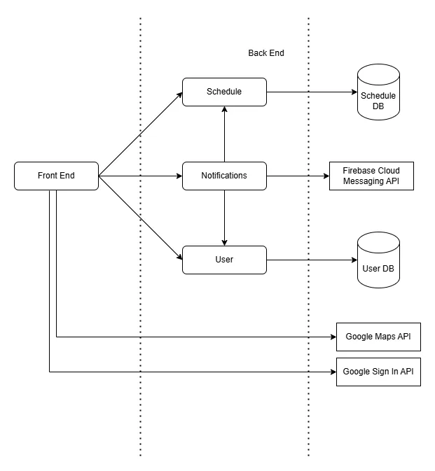
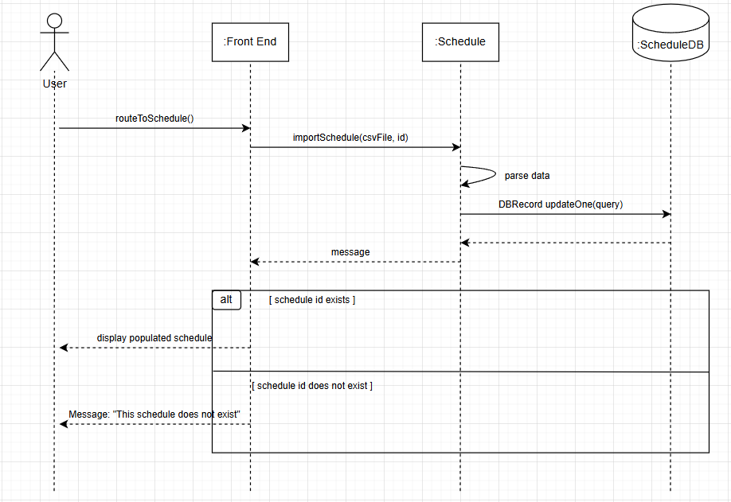
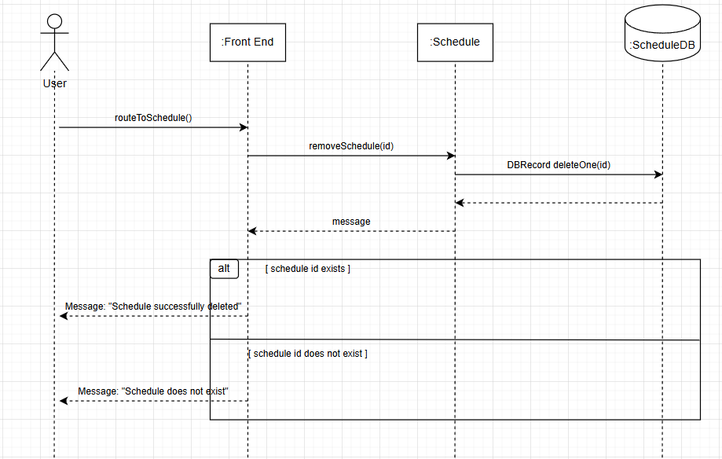
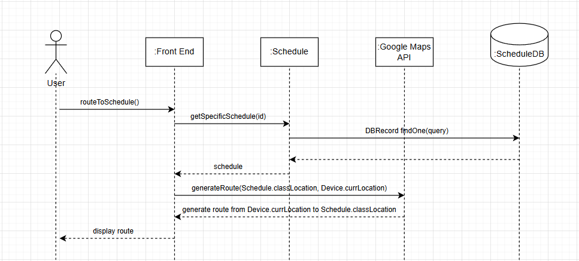
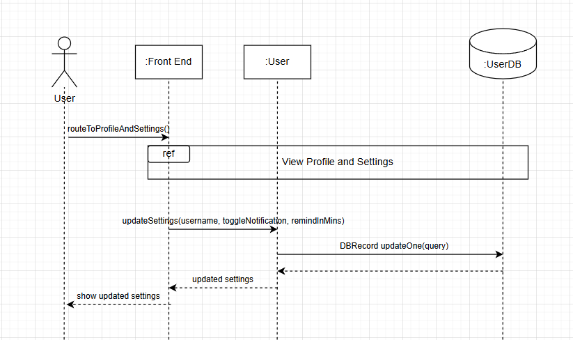
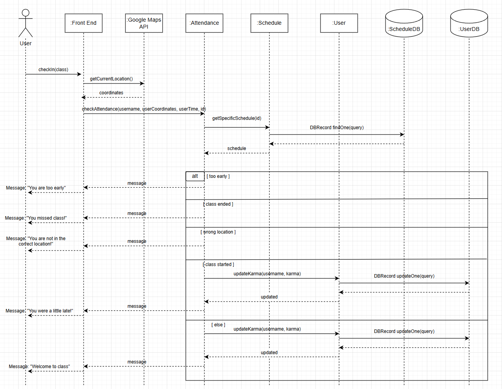

# M3 - Requirements and Design

## 1. Change History
<!-- Leave blank for M3 -->

## 2. Project Description
Get2Class is a gamified calendar to help students get to class on time. The main target audience for this app will be UBC students and professors. The main problem we are trying to solve is simplifying the Workday Student calendar as it is unintuitive and difficult to use. We will make it easy to set up your calendar using data from Workday. It can be difficult, especially for first-year’s, to find your classes using the building acronym on Workday. We will provide maps and walking routes. Additionally, we want to help motivate students to be punctual and attend their classes. Our application aims to solve this by implementing a notification and points system that helps and motivates users to go to classes and provides best routes to reach their next class.

## 3. Requirements Specification
### **3.1. Use-Case Diagram**


### **3.2. Actors Description**
1. **User**: The User is a student/professor which utilizes the application to help get them to their next class.
2. **Google Maps API**: The Google Maps API is the actor which will display locations and routes for the user. Additionally, this API will be utilized by the "View Route" and "Check Attendance" use case.
3. **Google Sign In API**: The Google Sign In API is the actor which authenticates users into the application. Additionally, this API will be utilized by the "User Login and Authentication" use case.

### **3.3. Functional Requirements**
<a name="fr1"></a>

1. **User Login and Authentication** 
    - **Overview**:
        1. Sign In to Account: System must allow user to utilize external authentication to login to the app
        2. Log Out of Account: System must allow user to log out of the app (which utilizes the external authentication)     
    - **Detailed Flow for Each Independent Scenario**: 
        1. **Sign In to Account**<a name="fr1_1"></a>:
            - **Description**: The user will utilize an external authentication API such as Google Sign In API to log themselves into the app with their credentials as a user.
            - **Primary actor(s)**: User, Google Sign In API
            - **Main success scenario**:
                1. User will click on the Google Sign In button
                2. A popup/rerouting of the page will occur providing the user a screen to enter their Google credentials into a box
                3. Once the user hits the Login button they will then be routed to the home page of the application
            - **Failure scenario(s)**:
                - 2a. The user enters invalid credentials
                    - 2a1. The app routes the user back to log in screen
                    - 2a2. An error message is displayed telling the user of the error (e.g. error getting credentials)
                    - 2a3. The app prompts the user to try to log in again
        2. **Log Out of Account**<a name="fr1_2"></a>:
            - **Description**: The user will utilize the external authentication API such as Google Sign In API to log themselves out of the app
            - **Primary actor(s)**: User, Google Sign In API
            - **Main success scenario**:
                1. User will click on the Log Out button
                2. A rerouting of the page will occur which brings the user back to the login page of the app
            - **Failure scenario(s)**:
                - N/A
    
2. **Manage Schedules**
    - **Overview**:
        1. Create Schedule: The system must allow the user to generate a blank schedule
        2. Import Schedule: The system must allow the user to import their schedule from Workday
        3. View Schedule: The system must allow the user to view their schedule in a clear and understandable format
        4. Delete Schedule: The system must allow the user to delete an existing schedule
    - **Detailed Flow for Each Independent Scenario**:
        1. **Create Schedule**<a name="fr2_1"></a>:
            - **Description**: The user can create a blank schedule with a name
            - **Primary actor(s)**: User
            - **Main success scenario**:
                1. The user clicks on the Add Schedule button
                2. The app prompts the user to enter a name for the new schedule
                3. Once the user enters the name, they will hit the Create button, the newly created schdule shows up on the screen
            - **Failure scenario(s)**:
                - 2a. The user enters an empty string for the schedule name
                    - 2a1. An error message is displayed telling the user that the schedule name cannot be empty
                    - 2a2. The app prompts the user to enter a valid name again
                - 2b. The user enters a schedule name that conflicts with an already existing schedule name
                    - 2b1. An error message is displayed telling the user that the name has been used previously
                    - 2b2. The app prompts the user to enter a new name
                - 2c. The user enters illegal characters into the schedule name
                    - 2c1. An error message is displayed telling the user that the schedule name does not meet the criteria of the schedule naming convention
                    - 2c2. The app prompts the user to enter a valid schedule name
        2. **Import Schedule**<a name="fr2_2"></a>:
            - **Description**: The user can import their own schdule from Workday onto a blank existing schedule the user has created
            - **Primary actor(s)**: User
            - **Main success scenario**:
                1. The user clicks on a an already existing blank schedule they have created
                2. The user will then click on the Import Schedule button
                3. A popup or page reroute will occur requesting the user to upload a (valid) .csv file (from Workday)
                4. Once the user successfully uploads a .csv file of their schedule, the blank schedule will become populated with the users imported schedule 
            - **Failure scenario(s)**:
                - 3a. The user uploads a non-valid or non .csv file
                    - 3a1. An error message is displayed telling the user that the uploaded file is not valid
                    - 3a2. The app will prompt the user to import a valid schedule again
        3. **View Schedule**<a name="fr2_3"></a>:
            - **Description**: The user can view their schedules and a particular schedule
            - **Primary actor(s)**: User
            - **Main success scenario**:
                1. The user selects (clicks on) one schedule
                2. The app opens up the schedule for the user to view
            - **Failure scenario(s)**:
                - N/A
        4. **Delete Schedule**<a name="fr2_4"></a>:
            - **Description**: The user can delete their existing schedules
            - **Primary actor(s)**: User
            - **Main success scenario**:
                1. The user selects (e.g. swipe or long press on) one schedule
                2. The app pops up a warning message for deleting the selected schedule
                3. If the user hits Confirm, the app deletes the schedule and the warning is dismissed
            - **Failure scenario(s)**:
                - 3a. The user hits Cancel or elsewhere
                    - 3a1. The warning message is dismissed
                    - 3a2. The app routes the user back to the original screen and does not delete the schedule

3. **View Map/Route**
    - **Overview**:
        1. View Route: The system must display to the user a route to their next class
    - **Detailed Flow for Each Independent Scenario**:
        1. **View Route**<a name="fr3_1"></a>:
            - **Description**: The user can view the optimal route to the next class based on their schedule and the current location
            - **Primary actor(s)**: User, Google Maps API
            - **Main success scenario**:
                1. The user clicks on View Route
                2. The app prompts the user to grant location permissions if not already granted
                3. The user sees their current location and destination location together with the optimal route on the screen
                4. When the user arrives (or their next class happens at their current location), the user gains or loses points (karma) based on their punctuality
            - **Failure scenario(s)**:
                - 2a. The user does not grant location permissions
                    - 2a1. The app prompts the user for permissions again with rationale
                    - 2a2. If the user denies twice, the app shows a dialog to tell the user to enable location permissions in the settings first
                    - 2a3. The app routes the user back to the previous screen

4. **Manage User Settings**
    - **Overview**:
        1. View Profile and Settings: The system must allow the user to view their profile and settings
        2. Update Notifications: The system must allow the user to manage their notification settings
    - **Detailed Flow for Each Independent Scenario**:
        1. **View Profile and Settings**<a name="fr4_1"></a>:
            - **Description**: The user can view their profile and accumulated points (karma)
            - **Primary actor(s)**: User
            - **Main success scenario**:
                1. The user clicks on their profile
                2. The app routes them to their profile page
            - **Failure scenario(s)**:
                - N/A
        2. **Update Settings**<a name="fr4_2"></a>:
            - **Description**: The user can change their notification preferences
            - **Primary Actor(s)**: User
            - **Main success scenario**:
                1. The user clicks on the notification settings
                2. The apps routes them to the notification settings screen
                3. The app prompts the user to grant notifications permissions if not already granted
                3. The user can toggle the Notifications option on or off
            - **Failure scenario(s)**:
                - 3a. The user does not grant notifications permissions
                    - 3a1. The app prompts the user for permissions again with rationale
                    - 3a2. If the user denies twice, the app shows a dialog to tell the user to enable notifications permissions in the settings first
                    - 3a3. The app routes the user back to the previous screen

5. **Check Attendance**
    - **Overview**:
        1. Check Attendance: The system must allow the user to check themselves into the class to obtain their points (karma)
    - **Detailed Flow for Each Independent Scenario**:
        1. **Check Attendance**<a name="fr5_1"></a>:
            - **Description**: The user can check themselves in when they arrive at the classroom and the system will provide to the user points (karma)
            - **Primary actor(s)**: User (Student/Professor), Google Maps API
            - **Main success scenario**:
                1. User clicks on the Check In button
                2. System will check that the user is in the right location within the allotted/right time
                3. System grants user points (karma)
            - **Failure scenario(s)**:
                - 2a. User is not in right location but within the allotted time
                    - 2a1. A popup message will occur notifying the user that they are not in the right location of their class location
                - 2b. User is in the right location but not within the allotted time
                    - 2b1. A popup message will occur notifying the user that they are not within the right location neither are they within the allotted time
                - 2c. User is not in the right location neither are they within the allotted time
                    - 2c1. A popup message will occur notifying the user that they are not within the right location neither are they within the allotted time

### **3.4. Screen Mockups**
N/A

### **3.5. Non-Functional Requirements**

1. **Schedule Usability** <a name="nfr1"></a>
    - **Description**: All schedules operations (create, import, view, delete) should be processed and reflected on the screen within 3 seconds of the user action
    - **Justification**: Quick schedule display avoids user dissatisfaction and saves time for busy professors and students to check the time and location for their upcoming classes
2. **Location Accuracy** <a name="nfr2"></a>
    - **Description**: The user's location should be track within a radius of 100 meters from the actual location
    - **Justification**: Accurate location tracking helps provide the optimal route, which is important for professors and students to get to class on time. This also ensures fairness for awarding and deducting points (karma)
2. **Route Accessibility** <a name="nfr3"></a>
    - **Description**: When logged in, the user can obtain the optimal route to their next class in at most five clicks
    - **Justification**: Quick route access ensures students and professors get route suggestions with minimal effort and avoids user dissatisfaction. This also help the user to get to class on time


## 4. Designs Specification
### **4.1. Main Components**
1. **Schedule**
    - **Purpose**: Manages schedule data and interacts with the schedule database/collection
    - **Interfaces**:
        1. List\<Schedule> getAllSchedules()
            - **Purpose**: Retrieves all the user's schedules as a list
        2. Schedule getSpecificSchedule(String id)
            - **Purpose**: Retrieves a specific schedule of the user given the schedule id and returns back a schedule to the user
        3. void addSchedule(String name)
            - **Purpose**: Creates a blank schedule with a given name
        4. void removeSchedule(String id)
            - **Purpose**: Removes a schedule with a given id
        5. void importSchedule(File csvFile, String id)
            - **Purpose**: Import a Workday schedule onto a newly created blank schedule by the user
2. **Attendance**
    - **Purpose**: Manages the attendance of a user and synchronizes communication between schedule data and Google Maps API data
    - **Interfaces**:
        1. String checkAttendance(String username, List\<double> userCooridnates, double userTime, String id)
            - **Purpose**: Checks if the user is in class based on the user current location, class location, and the current time of the class and user
3. **User**
    - **Purpose**: Manages the user settings and provides communication to user database/collection which stores the username, points (karma), and settings of a particular user
    - **Interfaces**:
        1. List\<NotificationSetting> getNotificationSettings(String username)
            - **Purpose**: Retrieves all notifications of a specific user
        2. void updateSettings(String username, bool toggleNotification, int remindInMins)
            - **Purpose**: Updates the settings of a particular user (e.g. turning "On"/"Off" notifications and setting how much time before a class a user wants to be notified)
        3. int getKarma(String username)
            - **Purpose**: Fetches the points (karma) of a given user
        4. void createNewUser()
            - **Purpose**: Creates a new user entry into the database if a newly logged in user does not exist in the database
        5. String findExistingUser(String username)
            - **Purpose**: Checks if a logged in user exists in the database already
        6. void updateKarma(String username, int karma)
            - **Purpose**: This increases or decreases the points (karma) of a user based on the location and time
4. **Additional Component (not back end related) For Reference: Front End**
    - **Purpose**: Manages front end interactions with all other back end components of the app
    - **Interfaces**:
        1. void routeToSchedule()
            - **Purpose**: This routes the user to the Schedule page and allows the user to view their schedules
        2. void routeToProfileAndSettings()
            - **Purpose**: This routes the user to the Profile and Settings page and allows the user to view their profile and Karma points, as well as their current user settings
        3. void signIn()
            - **Purpose**: Wrapper function that calls the Google sign in API. It allows the user to sign in with their Google account
        4. void signOut()
            - **Purpose**: Wrapper function that calls the Google sign in API. It allows the user to log out their account

### **4.2. Databases**
1. **Schedule**
    - **Purpose**: Stores the class-specific notifications and schedules of the users
2. **User**
    - **Purpose**: Stores all user information (e.g. username, points (karma), and settings)

### **4.3. External Modules**
1. **Google Sign In API** 
    - **Purpose**: This API is utilized to authenticate a user and log a user out
2. **Google Maps API**
    - **Purpose**: This API is used to display the map and determine the best route to the next class
3. **Firebase Cloud Messaging API**
    - **Purpose**: Provides push notifications within the application for users

### **4.4. Frameworks**
1. **Amazon Web Services (AWS) EC2**
    - **Purpose**: Used to host the application's server back end so that the front end application can communicate and exchange data with the APIs and database
    - **Reason**: We need a running EC2 instance (computer) in order to support our client-server architecture 

2. **Amazon Web Services (AWS) API Gateway**
    - **Purpose**: Used to link our EC2 server routes to a central API that the client (front end application) can call
    - **Reason**: AWS API Gateway will help our front end application call the routes on our EC2 through HTTPS rather than HTTP

3. **Docker**
    - **Purpose**: Synchronize our back end server and database to launch and connect together simultaneously
    - **Reason**: Simplifies the process of managing our EC2 instance which hosts all of our back end related technology (e.g. Express and MongoDB)

4. **MongoDB**
    - **Purpose**: Stores our model (persistence) layer related to Schedule and User data
    - **Reason**: MongoDB was used in Milestone 1 and will be simple to organize our data in a format that we are already familiar with

5. **Firebase Cloud Messaging API**
    - **Purpose**: Provides push notifications for users for when they should leave for their classes 
    - **Reason**: Firebase Cloud Messaging (FCM) already has existing integrations with Android applications, so this will simplify the implementation process for notifications

### **4.5. Dependencies Diagram**


### **4.6. Functional Requirements Sequence Diagram**
1. [**Sign In to Account**](#fr1_1)\

2. [**Log Out of Account**](#fr1_2)\

3. [**Create Schedule**](#fr2_1)\

4. [**Import Schedule**](#fr2_2)\

5. [**View Schedule**](#fr2_3)\

6. [**Delete Schedule**](#fr2_4)\

7. [**View Route**](#fr3_1)\

8. [**View Profile and Settings**](#fr4_1)\

9. [**Update Notifications**](#fr4_2)\

10. [**Check Attendance**](#fr5_1)\


### **4.7. Non-Functional Requirements Design**
1. [**Schedule Usability**](#nfr1)
    - **Validation**: We can set up a stopwatch and time how long each operation on the schedule takes. Then we check if the response time is less than 3 seconds.
2. [**Location Accuracy**](#nfr2)
    - **Validation**: We can open the app and check the attendance at different distance (e.g. 50m, 80m, 120m, 150m etc.) away from the location of the next class. Then by checking the attendance and Karma points, we know the location accuracy
3. [**Route Accessibility**](#nfr3)
    - **Validation**: We log in to our app and navigate to an arbitrary screen. Then we can test if we can get the route suggestions in 5 clicks or fewer


### **4.8. Main Project Complexity Design**
**Check Attendance**
- **Description**: Check whether a user is in the correct class location at the ccorrect time and manages the karma score of the user accordingly.
- **Why complex?**: This is complex because we have to synchronize all back end components of the app along with the front end Google Maps API. We must utilize the location of the user, the location of the classroom, the time the class starts (obtained from the Schedule DB), the time of the user, and adjust the karma score to give to the user based on several cases.
- **Design**:
    - **Input**: The client's username, the client's current location as GPS coordinates, the client's current time, and the schedule ID the user is interacting with. 
    - **Output**: A message will be provided back to the front end for the client. The back end will receive static strings that will be used to design the several cases.
    - **Main computational logic**:
        - Determining the class which the user is checking into: If a class is currently taking place or starting in less than 10 minutes, we will select this as the class that the user wants to check into. Otherwise, we will select whichever class is closest in time.
        - Conditional cases for determining which check in status to provide for the user:
            - If the class has already been marked as attended, notify the user
            - If it is before the class by more than 10 minutes, they are too early
            - If it is after the class, they are too late
            - If they are more than 50 meters from the class location, they are marked as in the wrong location
            - If it is mid way through the class, they are late. Mark the class as attended and add less points according to how late they are
            - Otherwise, they are considered on time for up to 10 minutes and they will be marked as attended and will be awarded the full number of points 
        - Class attendance will reset at the end of every day
    - **Pseudo-code**: ...
        ```
        String checkAttendance(username, userCoordinates, userTime, id):
            Class currClass = null
            Schedule s = Schedule.getSpecificSchedule(id)
            
            if (userTime < s[0].start - 10):
                currClass = s[0]
            
            for i in range(sizeOf(s) - 1):
                Class c1 = s[i]
                Class c2 = s[i + 1]

                // It is before or during the first class
                if (userTime < c1.end):
                    currClass = c1
                
                // It is closer to the first class than the second
                if (abs(userTime - c1.end) < abs(userTime - c2.start + 10)):
                    currClass = s[sizeOf(s) - 1]
            
            // It is closest to the last class
            if (currClass == null):
                currClass = s[sizeOf(s) - 1]
            
            if (currClass.attended):
                return "You already signed in to this class today!"
            elif (userTime < currClass.start - 10):
                return "You are too early!"
            elif (currClass.end < userTime):
                return "You missed class!"
            elif (50 < abs(userCoordinates - currClass.location)):
                return "You are not in the correct location!"
            elif (currClass.start < userTime):
                int lateness = userTime - currClass.start
                int classLength = currClass.end - currClass.start
                int karma = 10 * lateness/classLength
                User.updateKarma(username, karma)
                return "You were late to class!"
            else:
                User.updateKarma(username, karma)
                return "Welcome to class!"
        ```


## 5. Contributions
- ...
- ...
- ...
- ...